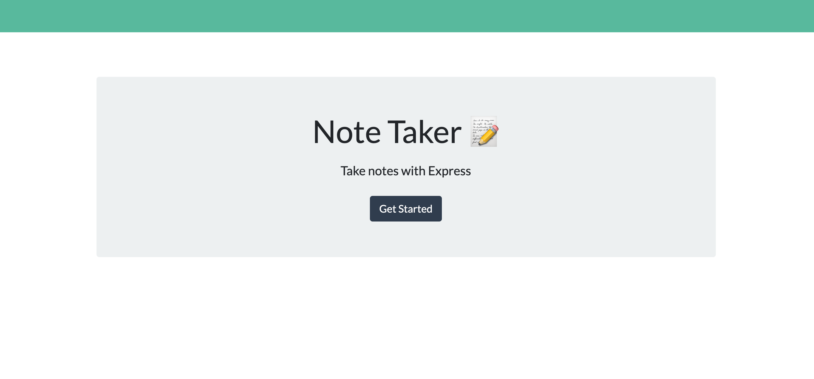
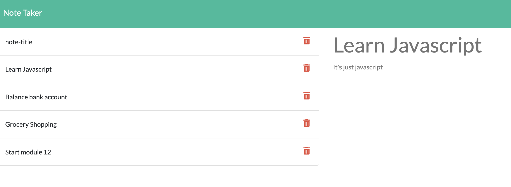

# Note-Taker

  
  
  ## Table of Contents
  -[Project Description](#projectDescription)
  -[Table of Contents](#tableofContents)
  -[Installation](#installation)
  -[Usage](#usage)
  -[License](#license)
  -[Contributing](#contributing)
  -[Tests](#tests)
  -[Questions](#questions)

  ## Project Description 
  A front and back end application for coding bootcamp using Express.js. 

  
  
  

  View a live demo 
  https://ancient-everglades-97811.herokuapp.com/
  
  ## Languages Used 
  Javascript,CSS,HTML,Node

  ### Installation Instructions
  Clone the repo. Download express.js by using the command npm i express. Make sure to initialize the server by hitting npm start. Or you can run the application off of the provided heroku link.

  ### What will the app be used for? 
  This application is used to take notes and help organize your day.

  ### How can you contribute?
  Fork your own copy and have fun!

  ### Tests 
  None

  ### Credits and Contributors 
  None

  ### License
  This application is covered under the Open license
  

  ### Questions
  -------------------------------------------------------------------------------------------------------
  
  Check me out on Github!: (https://github.com/Jillium) 
  
  Any questions? Email at holmesjillanne@gmail.com